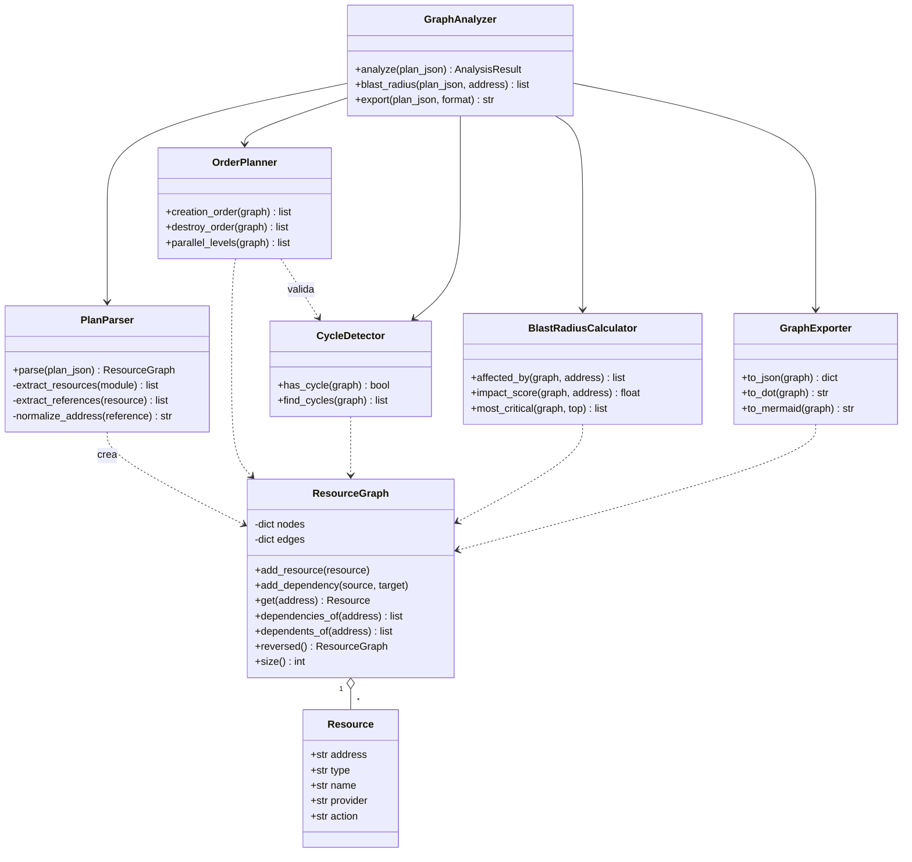
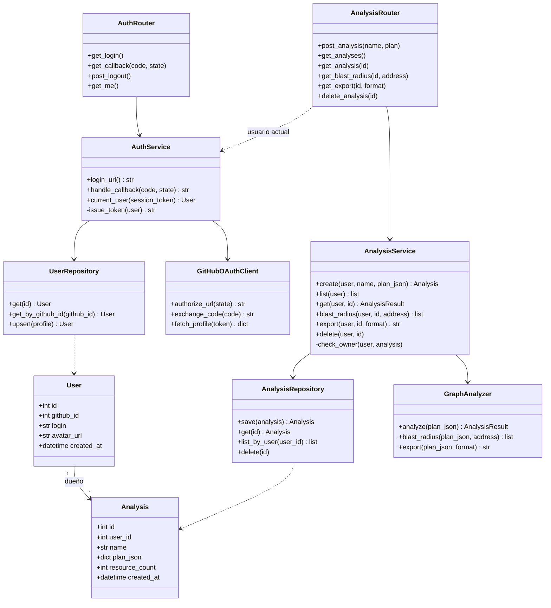
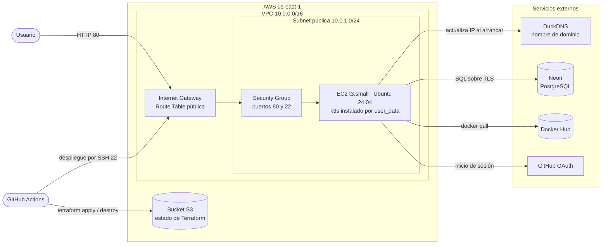
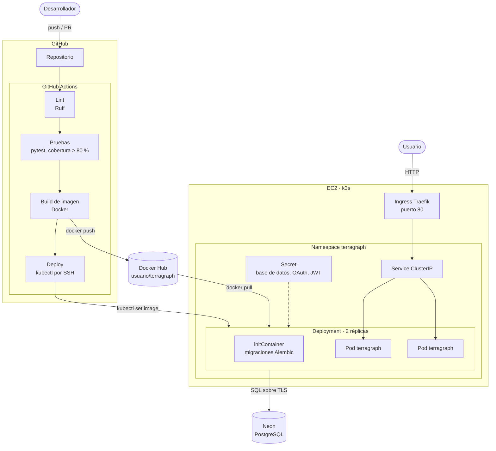
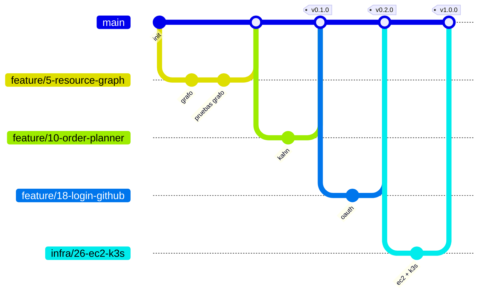

# TerraGraph

**Analizador de infraestructura Terraform basado en grafos**

Proyecto final de CI/CD

---

## 1. Descripción del proyecto

TerraGraph es un servicio web que recibe un plan de Terraform en formato JSON (la salida de `terraform show -json plan.tfplan`), construye el grafo dirigido de dependencias entre recursos y responde tres preguntas:

- **¿En qué orden se crean los recursos?** Orden topológico del grafo, agrupado en niveles que pueden crearse en paralelo.
- **¿Qué se rompe si destruyo este recurso?** Radio de impacto: todos los recursos que dependen, directa o transitivamente, del recurso elegido.
- **¿El plan tiene dependencias circulares?** Detección y reporte de ciclos.

Cada usuario inicia sesión con su cuenta de GitHub y guarda sus análisis para consultarlos después. Una página web dibuja el grafo y resalta el radio de impacto al seleccionar un nodo.

Los análisis se guardan en PostgreSQL hospedado en Neon, fuera de AWS. Así la infraestructura de AWS puede destruirse al terminar cada sesión de trabajo sin perder datos ni gastar créditos.

Como demostración, TerraGraph analiza el plan de Terraform de su propia infraestructura.

### Alcance

| Incluido | Fuera de alcance |
|---|---|
| Parseo del JSON de `terraform show` | Ejecutar `terraform plan` o `apply` desde el servicio |
| Orden de creación y destrucción | Estimación de costos |
| Niveles de paralelismo | Soporte de otros IaC (CloudFormation, Pulumi) |
| Radio de impacto | Compartir análisis entre usuarios |
| Detección de ciclos | Roles y permisos |
| Exportar el grafo a JSON, DOT y Mermaid | Comparar dos planes |
| Inicio de sesión con GitHub | |
| Guardar, listar y borrar análisis por usuario | |
| Visualización web del grafo | |

---

## 2. Componentes y métodos

El código se divide en dos capas: el **núcleo de grafos**, que es lógica pura sin dependencias externas, y la **aplicación**, que agrega API, usuarios y persistencia.

### Diagrama de clases: núcleo de grafos

### Diagrama de clases: aplicación

### Responsabilidades

| Componente | Responsabilidad | Algoritmo |
|---|---|---|
| `Resource` | Datos de un recurso del plan (dirección, tipo, acción) | — |
| `ResourceGraph` | Grafo dirigido; una arista A → B significa "A depende de B" | Listas de adyacencia |
| `PlanParser` | Convierte el JSON del plan en un `ResourceGraph` a partir de las referencias y los `depends_on` | Recorrido de módulos |
| `CycleDetector` | Encuentra dependencias circulares | DFS con tres colores |
| `OrderPlanner` | Orden de creación, de destrucción y niveles paralelos | Algoritmo de Kahn |
| `BlastRadiusCalculator` | Recursos afectados al destruir uno y ranking de los más críticos | BFS sobre el grafo invertido |
| `GraphExporter` | Serializa el grafo a JSON, DOT y Mermaid | — |
| `GraphAnalyzer` | Fachada del núcleo: orquesta parser y analizadores | — |
| `User`, `Analysis` | Modelos guardados en PostgreSQL | — |
| `UserRepository`, `AnalysisRepository` | Acceso a la base de datos | — |
| `GitHubOAuthClient` | Llamadas a GitHub para el flujo OAuth | — |
| `AuthService` | Inicio de sesión y emisión de la sesión (JWT en cookie) | — |
| `AnalysisService` | Guarda y consulta análisis; verifica que pertenezcan al usuario | — |
| `AuthRouter`, `AnalysisRouter` | Endpoints HTTP y validación de entrada | — |

Se guarda el plan, no el resultado: el análisis se recalcula al consultarlo, así una mejora en los algoritmos aplica también a los análisis ya guardados.

### API

| Método | Ruta | Descripción |
|---|---|---|
| `GET` | `/auth/login` | Redirige a GitHub para iniciar sesión |
| `GET` | `/auth/callback` | Recibe el código de GitHub y crea la sesión |
| `POST` | `/auth/logout` | Cierra la sesión |
| `GET` | `/api/me` | Datos del usuario actual |
| `POST` | `/api/analyses` | Guarda un plan y devuelve su análisis |
| `GET` | `/api/analyses` | Lista los análisis del usuario |
| `GET` | `/api/analyses/{id}` | Grafo, orden de creación, niveles paralelos y ciclos |
| `GET` | `/api/analyses/{id}/blast-radius?address=…` | Recursos afectados por un recurso |
| `GET` | `/api/analyses/{id}/export?format=…` | Grafo en JSON, DOT o Mermaid |
| `DELETE` | `/api/analyses/{id}` | Borra un análisis |
| `GET` | `/health` | Verificación de estado para Kubernetes |
| `GET` | `/` | Página web con la visualización del grafo |

---

## 3. Stack tecnológico

| Capa | Tecnología | Uso |
|---|---|---|
| Lenguaje | Python 3.12 | Lógica del grafo y API |
| API | FastAPI + Uvicorn | Endpoints REST y documentación OpenAPI automática |
| Validación | Pydantic | Modelos de entrada y salida |
| Base de datos | PostgreSQL en Neon | Usuarios y análisis; vive fuera de AWS |
| Acceso a datos | SQLAlchemy + Alembic | Modelos, consultas y migraciones |
| Autenticación | GitHub OAuth + JWT en cookie | Inicio de sesión y sesión del usuario |
| Front | HTML + JavaScript + Cytoscape.js | Dibujo interactivo del grafo, servido por FastAPI |
| Pruebas | pytest + pytest-cov | Pruebas unitarias y cobertura |
| Calidad | Ruff | Lint y formato |
| Entorno local | Docker Compose | Aplicación y Postgres en contenedores |
| Contenedor | Docker (multi-stage) | Imagen de la aplicación |
| Registro | Docker Hub | Almacén de imágenes versionadas |
| CI/CD | GitHub Actions | Pruebas, build, push, despliegue e infraestructura |
| IaC | Terraform con estado en S3 | Creación y destrucción de la infraestructura |
| Nube | AWS (VPC, EC2, S3) | Hospedaje y estado de Terraform |
| Orquestación | k3s (Kubernetes) + Traefik | Ejecución del contenedor y entrada HTTP |
| DNS | DuckDNS | Nombre fijo aunque cambie la IP |
| Gestión | GitHub Projects + Issues | Plan de trabajo |
| Documentación | GitHub Wiki | Esta presentación |

---

## 4. Recursos que se van a crear

### Diagrama de infraestructura

El usuario entra por el nombre de DuckDNS, que apunta a la IP pública de la instancia. Terraform, ejecutado desde GitHub Actions, crea y destruye todo lo que está dentro de la VPC.

### Recursos de Terraform

| Recurso | Tipo | Propósito |
|---|---|---|
| Red | `aws_vpc` | Red aislada del proyecto |
| Subred | `aws_subnet` | Subred pública para la instancia |
| Salida a internet | `aws_internet_gateway` | Acceso desde y hacia internet |
| Rutas | `aws_route_table`, `aws_route_table_association` | Ruta por defecto hacia el gateway |
| Firewall | `aws_security_group` | Puerto 80 para la aplicación y 22 para el despliegue |
| Llave | `aws_key_pair` | Llave pública para el acceso SSH del pipeline |
| Servidor | `aws_instance` | EC2 con k3s instalado por `user_data` |
| Estado | backend `s3` | Guarda el estado para que el pipeline pueda aplicar y destruir |

El `user_data` de la instancia instala k3s, registra la IP en DuckDNS, crea el `Secret` de Kubernetes y aplica los manifiestos del repositorio.

### Recursos fuera de Terraform

| Recurso | Dónde | Permanencia |
|---|---|---|
| Bucket S3 del estado | AWS | Permanente; se crea una sola vez |
| Base de datos PostgreSQL | Neon | Permanente |
| OAuth App | GitHub | Permanente; su URL de retorno apunta al nombre de DuckDNS |
| Subdominio | DuckDNS | Permanente |
| Repositorio de imágenes | Docker Hub | Permanente |

Todo lo que cuesta créditos (VPC y EC2) se crea y se destruye en cada sesión. Lo permanente es gratuito o de costo mínimo.

### Ciclo de una sesión de trabajo

1. Iniciar el laboratorio de AWS y copiar las credenciales temporales a los secretos de GitHub.
2. Ejecutar el workflow **infra-up**: `terraform apply` crea la red y la instancia, y la aplicación queda disponible con los datos de la sesión anterior.
3. Trabajar normalmente: cada merge a `main` despliega la versión nueva.
4. Ejecutar el workflow **infra-down**: `terraform destroy` elimina todo lo que consume créditos.

### Diagrama de deployment

Los pods no guardan nada en disco: la sesión viaja en una cookie firmada y los datos están en Neon. Por eso las dos réplicas son intercambiables y el rolling update no pierde información.

### Workflows

| Workflow | Disparador | Qué hace |
|---|---|---|
| `ci.yml` | Pull request hacia `main` | Lint, pruebas con cobertura y build de la imagen sin publicar |
| `cd.yml` | Merge a `main` o tag `vX.Y.Z` | Lint, pruebas, build, push a Docker Hub y despliegue |
| `infra-up.yml` | Manual | `terraform apply` |
| `infra-down.yml` | Manual | `terraform destroy` |

El despliegue se conecta por SSH a la instancia, usando su nombre de DuckDNS, y ejecuta `kubectl set image` y `kubectl rollout status`. Si la infraestructura está apagada, el paso se omite con un aviso y la imagen queda publicada para la siguiente sesión.

El despliegue no usa credenciales de AWS; solo los workflows de infraestructura las necesitan. El puerto 22 queda abierto a internet porque los runners de GitHub no tienen IP fija, así que el acceso se protege con la llave y no con el firewall.

### Pruebas unitarias

Las pruebas corren con pytest en cada pull request. El pipeline falla si alguna prueba falla o si la cobertura baja de 80 %.

| Módulo | Casos principales |
|---|---|
| `ResourceGraph` | Agregar nodos y aristas; dependencias y dependientes; grafo invertido; recurso inexistente |
| `PlanParser` | Plan mínimo; referencias entre recursos; `depends_on` explícito; módulos anidados; recursos con `count`; JSON inválido |
| `CycleDetector` | Grafo sin ciclos; ciclo simple; ciclo largo; autorreferencia; varios ciclos |
| `OrderPlanner` | Cadena lineal; grafo en diamante; componentes desconectados; el orden de destrucción es el inverso; error si hay ciclo |
| `BlastRadiusCalculator` | Nodo hoja (sin afectados); nodo raíz (todos afectados); dependencias transitivas; ranking de críticos |
| `GraphExporter` | Salida válida en JSON, DOT y Mermaid; grafo vacío |
| `AuthService` | Código válido crea o actualiza al usuario; código inválido; `state` incorrecto; sesión expirada o alterada |
| `AnalysisService` | Guardar, listar y borrar; un usuario no puede ver ni borrar análisis ajenos; análisis inexistente |
| Routers | Códigos 200, 401 sin sesión, 404 y 422 con el cliente de pruebas de FastAPI |

- **Unitarias:** el núcleo de grafos no necesita nada externo. Los servicios se prueban con repositorios en memoria y un cliente de GitHub simulado.
- **Integración:** los repositorios se prueban contra un contenedor de Postgres que GitHub Actions levanta como servicio.
- **Datos de prueba:** planes JSON pequeños en `tests/fixtures/`, además del plan real de la infraestructura del proyecto.

### Docker Hub

- **Repositorio:** `<usuario>/terragraph` (público).
- **Imagen:** build multi-stage sobre `python:3.12-slim`, ejecutada con usuario sin privilegios. La misma imagen corre las migraciones en el `initContainer`.
- **Etiquetas:**
  - `sha-<commit>`: una por cada merge a `main`; es la que se despliega, para poder regresar a una versión exacta.
  - `latest`: la última versión de `main`.
  - `X.Y.Z`: versiones liberadas con un tag de Git.

### Secretos en GitHub

| Secreto | Uso | Se renueva |
|---|---|---|
| `DOCKERHUB_USERNAME`, `DOCKERHUB_TOKEN` | Publicar la imagen | No |
| `AWS_ACCESS_KEY_ID`, `AWS_SECRET_ACCESS_KEY`, `AWS_SESSION_TOKEN` | Terraform (`infra-up` e `infra-down`) | En cada sesión |
| `EC2_SSH_KEY` | Llave privada para el despliegue por SSH | No |
| `DATABASE_URL` | Conexión a Neon | No |
| `OAUTH_CLIENT_ID`, `OAUTH_CLIENT_SECRET` | Inicio de sesión con GitHub | No |
| `JWT_SECRET` | Firma de la sesión | No |
| `DUCKDNS_TOKEN` | Actualizar el nombre de dominio | No |

Los secretos de la aplicación llegan a la instancia como variables sensibles de Terraform y terminan en un `Secret` de Kubernetes. La llave pública de SSH se guarda en el repositorio, por lo que la misma llave sirve aunque la instancia se recree.

---

## 5. Estrategia de ramas

Se usa **GitHub Flow**: una sola rama estable y ramas cortas por issue.

| Regla | Detalle |
|---|---|
| Rama estable | `main`, siempre desplegable y protegida |
| Nombres de ramas | `feature/<issue>-<descripción>`, `fix/…`, `infra/…`, `docs/…` |
| Integración | Solo por pull request; los checks de lint y pruebas son obligatorios |
| Merge | Squash merge, para dejar un commit por issue |
| Commits | Conventional Commits (`feat:`, `fix:`, `test:`, `ci:`, `docs:`) |
| Versiones | Tags `vX.Y.Z` sobre `main` con versionado semántico |
| Cierre de issues | El PR incluye `Closes #<issue>` |

---

## 6. Plan de trabajo

### Calendario

| Semana | Milestone | Entregable |
|---|---|---|
| 1 | M1 · Diseño y base | Repositorio, Wiki, board, esqueleto del proyecto y CI mínimo |
| 2 | M2 · Núcleo de grafos | `ResourceGraph`, `PlanParser` y `CycleDetector` con pruebas |
| 3 | M3 · Análisis | `OrderPlanner`, `BlastRadiusCalculator`, exportador y `GraphAnalyzer` |
| 4 | M4 · Persistencia y login | Postgres, migraciones, repositorios, login con GitHub y endpoints |
| 5 | M5 · Contenedor y pipeline | Dockerfile, Docker Hub y pipeline completo de CI |
| 6 | M6 · Infraestructura y despliegue | Terraform, k3s, workflows de infraestructura y despliegue continuo |
| 7 | M7 · Visualización y cierre | Página web, demo con el plan propio y documentación final |

### GitHub Project Board

- **Columnas:** Backlog → To Do → In Progress → In Review → Done.
- **Campos:** Milestone, Prioridad (alta, media, baja), Tamaño (S, M, L), Etiqueta.
- **Etiquetas:** `feature`, `test`, `ci-cd`, `infra`, `docs`, `bug`.
- **Automatización:** un issue pasa a In Progress al crear su rama, a In Review al abrir el PR y a Done al hacer merge.

### Issues

| # | Issue | Etiqueta | Milestone | Tamaño |
|---|---|---|---|---|
| 1 | Crear repositorio, protección de `main` y plantillas de issue y PR | `docs` | M1 | S |
| 2 | Publicar la presentación en la Wiki | `docs` | M1 | S |
| 3 | Esqueleto del proyecto FastAPI con `/health` | `feature` | M1 | S |
| 4 | Workflow de CI con Ruff y pytest en pull requests | `ci-cd` | M1 | M |
| 5 | Implementar `Resource` y `ResourceGraph` | `feature` | M2 | M |
| 6 | Pruebas unitarias de `ResourceGraph` | `test` | M2 | S |
| 7 | Implementar `PlanParser` para el JSON de `terraform show` | `feature` | M2 | L |
| 8 | Fixtures de planes y pruebas de `PlanParser` | `test` | M2 | M |
| 9 | Implementar `CycleDetector` con pruebas | `feature` | M2 | M |
| 10 | Implementar `OrderPlanner` (orden y niveles paralelos) con pruebas | `feature` | M3 | M |
| 11 | Implementar `BlastRadiusCalculator` con pruebas | `feature` | M3 | M |
| 12 | Implementar `GraphExporter` (JSON, DOT, Mermaid) con pruebas | `feature` | M3 | S |
| 13 | Implementar `GraphAnalyzer` como fachada del núcleo, con pruebas | `feature` | M3 | S |
| 14 | Docker Compose con Postgres local y modelos `User` y `Analysis` | `feature` | M4 | M |
| 15 | Migraciones con Alembic | `feature` | M4 | S |
| 16 | Repositorios y pruebas de integración con Postgres en CI | `test` | M4 | M |
| 17 | Crear la base en Neon y la OAuth App en GitHub | `infra` | M4 | S |
| 18 | Login con GitHub: `GitHubOAuthClient`, `AuthService` y `AuthRouter` con pruebas | `feature` | M4 | L |
| 19 | `AnalysisService` y endpoints para guardar, listar, consultar y borrar análisis | `feature` | M4 | M |
| 20 | Pruebas de la API y umbral de cobertura de 80 % | `test` | M4 | M |
| 21 | Dockerfile multi-stage con usuario sin privilegios | `ci-cd` | M5 | S |
| 22 | Crear repositorio en Docker Hub y secretos en GitHub | `ci-cd` | M5 | S |
| 23 | Job de build y push con etiquetas `latest`, `sha` y versión | `ci-cd` | M5 | M |
| 24 | Bucket S3 y backend remoto para el estado de Terraform | `infra` | M6 | S |
| 25 | Terraform: VPC, subred, gateway, rutas y security group | `infra` | M6 | M |
| 26 | Terraform: EC2 con k3s por `user_data`, key pair y DuckDNS | `infra` | M6 | L |
| 27 | Manifiestos: Deployment con migraciones, Service, Ingress, Secret y probes | `infra` | M6 | M |
| 28 | Workflows manuales `infra-up` e `infra-down` | `ci-cd` | M6 | M |
| 29 | Job de despliegue por SSH con `kubectl set image` y verificación del rollout | `ci-cd` | M6 | M |
| 30 | Página web: login, lista de análisis guardados y grafo con Cytoscape.js | `feature` | M7 | L |
| 31 | Resaltar el radio de impacto al seleccionar un nodo | `feature` | M7 | M |
| 32 | Opcional: HTTPS con Let's Encrypt en Traefik | `infra` | M7 | M |
| 33 | Demo: analizar el plan de la infraestructura propia | `docs` | M7 | S |
| 34 | README, Wiki final y release `v1.0.0` | `docs` | M7 | S |

---

## 7. Entregables

- **Presentación del proyecto:** este documento en la Wiki de GitHub y su versión en PDF.
- **Plan de proyecto:** GitHub Project Board con los 34 issues y 7 milestones.
